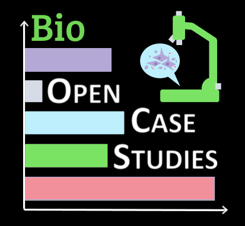

---
# General Settings
format: html
echo: false
warning: false

# Theme Settings
theme: default
barposition: top
footer-left: "Made with [surveydown](https://surveydown.org)"
footer-right: '[<i class="bi bi-github"></i> Source Code](https://github.com/opencasestudies/surveydown_surveys/tree/reviewSurveyDraft)'

# Survey Settings
show-previous: true
start-page: welcome
use-cookies: false #update after building
auto-scroll: false
rate-survey: false
system-language: en
highlight-unanswered: true
highlight-color: blue
capture-metadata: true
all-questions-required: true
---

```{r}
library(surveydown)
```

::: {.sd_page id=welcome}

# Biomedical Open Case Studies Data Science Educator Review Guidelines

<!-- include logo -->
<div style="text-align: right;">

</div>

---

Thank you again for agreeing to review our case studies!

[Open Case Studies](https://www.opencasestudies.org/) is a project intended to make data science and statistics more accessible.

We create and curate example guides using real-world data to demonstrate data science, statistical, genomics, public health methods and principles and beyond. In each case study, we also hope to shed light on an important issue facing the United States or the world.

The case studies are for demonstrative purposes only and do not necessarily show the best way to analyze the data utilized but rather showcase a specific method or concept using data that is relevant, challenging, and interesting. We hope that our case studies can be useful as a teaching tool in the classroom and as standalone examples as a supplement to the classroom or for independent learners.

This guide is intended to help you provide reviews for case studies. Please consider the following topics and questions as well as our [code of conduct](https://docs.google.com/document/d/1E3K2sGlOdTMcZnBmIF7OceJWrUMWXpDC3slWygaury4/edit?usp=sharing). **Please provide feedback to authors here** as we are collecting data about the general review process. Feel free to open issues describing specific problems or provide an additional partner PR on GitHub with specific changes if you wish. Please contact us if you have questions or concerns!

:::

::: {.sd_page id=page2}

## Case Study Identification

```{r}

sd_question(
  type   = 'select',
  id     = 'which_case_study',
  label  = 'Which case study are you reviewing?',
  option = c(
    'Single Cell Transcriptomics'               = 'single_cell',
    'Deep Learning'                             = 'deep_learning',
    'Spatial Transcriptomics'                   = 'spatial',
    'Latent Variables and Matrix Factorization' = 'latent_vars',
    'Temporal analysis'                         = 'temporal',
    'Containers'                                = 'containers',
    'Version Control and Code Review'           = 'version_control',
    'Big Data'                                  = 'big_data',
    'Other'                                     = 'other'
  )
)

sd_question(
  type  = 'text',
  id    = 'which_case_study_other',
  label = 'What is the case study you are reviewing?'
)

sd_question(
  type  = 'text',
  id    = 'reviewer',
  label = 'What is your name/the name of the reviewer of the case study?'
)

```

:::

::: {.sd_page id=page3}

## Overall Review of `r sd_output("which_case_study", type = 'label_option')` Case Study

```{r}
sd_question(
  type  = 'textarea',
  id    = 'overall_opinion',
  label = 'What is your overall opinion? (e.g., topic of interest, useful, explanations clear)'
)

sd_question(
  type   = 'mc',
  id     = 'compilation',
  label  = 'Does the case study compile? (please try knitting the document on your own)',
  option = c(
    'Yes' = 'yes',
    'No'  = 'no'
  )
)

#question to provide error if compilation question response is No.
sd_question(
  type  = 'textarea',
  id    = 'compilation_error',
  label = 'Please provide the error message or a description of the compilation error. If you would prefer to provide a screenshot, please email it or open an issue in the appropriate GitHub repository.'
)


sd_question(
  type   = 'mc',
  id     = 'overall_suggestions',
  label  = 'Do you have suggestions on how to improve?',
  option = c(
    'Yes' = 'yes',
    'No'  = 'no'
  )
)

#question to provide sugestions if overall_suggestions response is Yes.
sd_question(
  type  = 'textarea',
  id    = 'overall_suggestions_to_improve',
  label = 'What are your general suggestions to improve this case study?'
)


sd_question(
  type   = 'mc',
  id     = 'gen_org',
  label  = 'Considering the general organization of the case study, would you suggest making any changes?',
  option = c(
    'Yes' = 'yes',
    'No'  = 'no'
  )
)

#question to provide suggestions if gen_org response is Yes.
sd_question(
  type  = 'textarea',
  id    = 'gen_org_suggestions',
  label = "What are your suggestions for changing the organization of the case study? Please note that all case studies have a standard general organization (e.g., the sections like Motivation, Context, Limitations, Data, Import, Wrangling, Visualization, Analysis, Summary) and we're looking for deeper feedback."
)

sd_question(
  type   = 'mc',
  id     = 'main_viz',
  label  = 'Would you make any changes to the main visualizations?',
  option = c(
    'Yes' = 'yes',
    'No'  = 'no'
  )
)

#question to provide suggestions if main_viz response is Yes.
sd_question(
  type  = 'textarea',
  id    = 'main_viz_suggestions',
  label = 'What changes would you make to the main visualizations?'
)

sd_question(
  type   = 'mc',
  id     = 'technical_errors',
  label  = 'Do you see any technical errors?',
  option = c(
    'Yes' = 'yes',
    'No'  = 'no'
  )
)

#question to provide details/description of technical errors if technical_errors is Yes.
sd_question(
  type  = 'textarea',
  id    = 'technical_errors_explained',
  label = 'Please describe the technical error(s) you observed and how you would correct each error.'
)

sd_question(
  type   = 'mc',
  id     = 'stat_errors',
  label  = 'Do you see any statistical errors?',
  option = c(
    'Yes' = 'yes',
    'No'  = 'no'
  )
)

#question to provide details/description of statistical errors if stat_errors is Yes.
sd_question(
  type  = 'textarea',
  id    = 'stat_errors_explained',
  label = 'Please describe the statistical error(s) you observed and how you would correct each error.'
)

sd_question(
  type   = 'mc',
  id     = 'newer_equiv',
  label  = 'Do you see any packages or functions that you think might have a newer equivalent? (We generally try to use tidyverse where possible.)',
  option = c(
    'Yes' = 'yes',
    'No'  = 'no'
  )
)

#question to provide details if newer_equiv is Yes.
sd_question(
  type  = 'textarea',
  id    = 'newer_equiv_explained',
  label = 'Please list the packages or functions and their newer equivalents.'
)

sd_question(
  type   = 'mc',
  id     = 'resource_links',
  label  = 'Do you dislike any of the links used or do you have suggestions for other resources that should be included?',
  option = c(
    'Yes' = 'yes',
    'No'  = 'no'
  )
)

#question to provide details if resource_links is Yes.
sd_question(
  type  = 'textarea',
  id    = 'resource_links_explained',
  label = 'Please describe any links or resources that are included that you would remove or any other resources that you would recommend should be included.'
)

```

:::

::: {.sd_page id=page4}

## Teachability of `r sd_output("which_case_study", type = 'label_option')` Case Study

```{r}

sd_question(
  type   = 'mc',
  id     = 'class_use',
  label  = 'Can you envision using this in a class?',
  option = c(
    'Yes' = 'yes',
    'No'  = 'no'
  )
)

#question to explain if class_use is No
sd_question(
  type  = 'textarea',
  id    = 'class_use_explained',
  label = 'What changes to this case study would make it more likely for you to use in a class?'
)

sd_question(
  type  = 'textarea',
  id    = 'length_depth',
  label = 'What do you think about the **length** and the level of **depth**?'
)

sd_question(
  type   = 'mc',
  id     = 'topic_more',
  label  = 'Are there any topics that need **more** explanation?',
  option = c(
    'Yes' = 'yes',
    'No'  = 'no'
  )
)

#question to explain if topic_more is Yes
sd_question(
  type  = 'textarea',
  id    = 'topic_more_explained',
  label = 'Which topics need more explanation?'
)

sd_question(
  type   = 'mc',
  id     = 'topic_less',
  label  = 'Are there any topics that need **less** explanation?',
  option = c(
    'Yes' = 'yes',
    'No'  = 'no'
  )
)

#question to explain if topic_less is Yes
sd_question(
  type  = 'textarea',
  id    = 'topic_less_explained',
  label = 'Which topics are over-explained?'
)

sd_question(
  type  = 'textarea',
  id    = 'interactivity_thoughts',
  label = 'The authors should have included question prompts to help with instruction and to help learners think more deeply about topics. Are there any additional questions or other features that would help you teach this in the classroom?'
)

sd_question(
  type   = 'mc',
  id     = 'limiting_barriers',
  label  = 'Are there any limiting barriers for you to teach using this case study?',
  option = c(
    'Yes' = 'yes',
    'No'  = 'no'
  )
)

#question to explain if limiting_barriers is Yes
sd_question(
  type  = 'textarea',
  id    = 'limiting_barriers_explained',
  label = 'Do you have any suggestions on how we can remove the limiting barriers?'
)

sd_question(
  type  = 'textarea',
  id    = 'questions_hw_thoughts',
  label = 'What are your thoughts on the questions and suggested homework? Did you like them? Do you have suggestions for others?'
)
```

:::

::: {.sd_page id=page5}

## Standalone Capacity of `r sd_output("which_case_study", type = 'label_option')` Case Study

```{r}

sd_question(
  type   = 'mc',
  id     = 'standalone_missing',
  label  = 'Reflecting on this case study, if you found it on your own and wanted to learn about these topics, is there anything that is missing or that could use more explanation?',
  option = c(
    'Yes' = 'yes',
    'No'  = 'no'
  )
)

#question to explain if standalone_missing is Yes
sd_question(
  type  = 'textarea',
  id    = 'standalone_missing_explained',
  label = 'What is missing or could use more explanation?'
)

sd_question(
  type   = 'mc',
  id     = 'code_needs_more',
  label  = 'Does any of the code need further explanation?',
  option = c(
    'Yes' = 'yes',
    'No'  = 'no'
  )
)

#question to explain if code_needs_more is Yes
sd_question(
  type  = 'textarea',
  id    = 'code_needs_more_explained',
  label = 'Which code specifically needs further explanation?'
)

sd_question(
  type  = 'textarea',
  id    = 'interactive_components',
  label = 'If the authors were to add interactive components or additional interactive components using `learnr` for independent leaners, what do you think would be especially helpful?'
)
```

:::

::: {.sd_page id=page6}

## Accessibility of `r sd_output("which_case_study", type = 'label_option')` Case Study

```{r}
sd_question(
  type   = 'mc',
  id     = 'alt_text_present',
  label  = 'Do all images have alternative text?',
  option = c(
    'Yes'    = 'yes',
    'No'     = 'no',
    'Unsure' = 'unsure'
  )
)

#question if alt_text_present is No
sd_question(
  type  = 'textarea',
  id    = 'alt_text_present_explained',
  label = 'Which images do not have alternative text?'
)

sd_question(
  type   ='mc',
  id     = 'alt_text_useful',
  label  = 'Is the alternative text useful and appropriate for describing all necessary details of the image?',
  option = c(
    'Yes'    = 'yes',
    'No'     = 'no',
    'Unsure' = 'unsure'
  )
)

#question if alt_text_useful is No
sd_question(
  type  = 'textarea',
  id    = 'alt_text_useful_explained',
  label = 'Which images need edits to make the alternative text more useful or appropriate for describing all necessary details of the image?'
)

sd_question(
  type   = 'mc',
  id     = 'color_palette',
  label  = 'Do all plots use colors that are distinguishable to those with color vision deficiency (CVD)?',
  option = c(
    'Yes' = 'yes',
    'No'  = 'no'
  )
)

#question if color_palette is No
sd_question(
  type  = 'textarea',
  id    = 'color_palette_explained',
  label = 'Which plots use inaccessible color palettes?'
)

sd_question(
  type   = 'mc',
  id     = 'gen_accessibility',
  label  = 'Any other suggestions to improve accessibility?',
  option = c(
    'Yes' = 'yes',
    'No'  = 'no'
  )
)

sd_question(
  type  = 'textarea',
  id    = 'gen_accessibility_explained',
  label = 'Please provide your additional suggestions to improve accessibility.'
)
```

:::


::: {.sd_page id=page7}

## Ethics of `r sd_output("which_case_study", type = 'label_option')` Case Study


```{r}
sd_question(
  type   = 'mc',
  id     = 'data_methods_limits',
  label  = 'Are the limitations of the data and methods both comprehensively enumerated and adequately described?',
  option = c(
    'Yes' = 'yes',
    'No'  = 'no'
  )
)

#Question if data_methods_limits is No
sd_question(
  type  = 'textarea',
  id    = 'data_methods_limits_explained',
  label = 'Please provide any additional limitations of the data or methods that need to be included or suggestions on how to improve the description of the included limitations which were not adequately described.'
)

sd_question(
  type   = 'mc',
  id     = 'ethical_considerations',
  label  = 'Is there anything about the case study that could be improved in terms of ethical considerations?',
  option = c(
    'Yes' = 'yes',
    'No'  = 'no'
  )
)

#Question if ethical_considerations is Yes
sd_question(
  type  = 'textarea',
  id    = 'ethical_considerations_explained',
  label = 'Please explain what could be improved in regards to the ethical considerations.'
)

sd_question(
  type   = 'mc',
  id     = 'disclaimers',
  label  = 'Have the authors created disclaimers when difficult or traumatic topics are covered?',
  option = c(
    'Yes' = 'yes',
    'No'  = 'no',
    'NA'  = 'not_applicable'
  )
)

#Question if disclaimers is No
sd_question(
  type  = 'textarea',
  id    = 'disclaimers_explained',
  label = 'What disclaimer(s) should we add?'
)

sd_question(
  type   = 'mc',
  id     = 'relevant_diff_topic_resources',
  label  = 'Have the authors provided helpful links related to difficult or traumatic topics? For example, consider this [case study](https://www.opencasestudies.org/ocs-bp-youth-mental-health/#Additional_Information) (scrolling down to the pink section): example provides additional information about national hotlines for mental health and suicide preventation are included.',
  option = c(
    'Yes' = 'yes',
    'No'  = 'no',
    'NA'  = 'not_applicable'
  )
)

#Question if relevant_diff_topic_resources is No
sd_question(
  type  = 'textarea',
  id    = 'relevant_diff_topic_resources_explained',
  label = 'Please provide any helpful links that you would recommend including or type NA if you do not have any.'
)
```

:::

::: {.sd_page id=page8}

## Reproducibility of `r sd_output("which_case_study", type = 'label_option')` Case Study

```{r}
sd_question(
  type   = 'mc',
  id     = 'reproducibility_sections',
  label  = 'Are all sections thoroughly described well enough for learners and instructors to reproduce the results?',
  option = c(
    'Yes' = 'yes',
    'No'  = 'no'
  )
)

#Question if reproducibility_sections is No
sd_question(
  type   = 'textarea',
  id     = 'reproducibility_sections_explained',
  label  = 'Which sections should be more thoroughly described and what additions do you need so that results can be reproduced?'
)

sd_question(
  type   = 'mc',
  id     = 'session_info',
  label  = 'Is session information shared?',
  option = c(
    'Yes' = 'yes',
    'No'  = 'no'
  )
)

sd_question(
  type   = 'mc',
  id     = 'reproducibility_code_robust',
  label  = 'Could any of the code be written in a more programmatic method to better ensure reproducibility over time as data sources may change?',
  option = c(
    'Yes' = 'yes',
    'No ' = 'no'
  )
)

#Question if reproducibility_code_robust is Yes
sd_question(
  type  = 'textarea',
  id    = 'reproducibility_code_robust_explained',
  label = 'What code specifically would you recommend writing in a more programmatic method?'
)

sd_question(
  type   = 'mc',
  id     = 'reproducibility_tools_tips',
  label  = 'Any missing relevant reproducibility tips or tools?',
  option = c(
    'Yes' = 'yes',
    'No'  = 'no'
  )
)

#Question if reproducibility_tools_tips is Yes
sd_question(
  type  = 'textarea',
  id    = 'reproducibility_tools_tips_explained',
  label = 'What relevant reproducibility tips or tools should be included?'
)
```

:::

::: {.sd_page id=page9}

## Free Response of `r sd_output("which_case_study", type = 'label_option')` Case Study

```{r}
sd_question(
  type  = 'textarea',
  id    = 'final_thoughts',
  label = "Any other thoughts, comments, or questions?"
)

```

:::

::: {.sd_page id=end}

## Thank you for providing your review for the `r sd_output("which_case_study", type = 'label_option')` Case Study!

```{r}
sd_close()
```

:::
